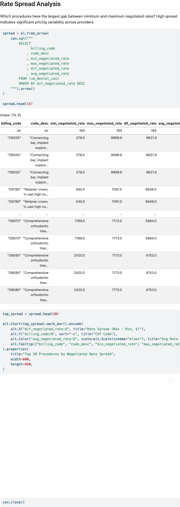

# Pricing Analysis for Common Dental Codes

Analyzes the Common Dental Terminology codes (CDTs) and their prices from a variety of health insurance providers to determine which procedures would utilize UCleaner LLC's products.

## Dental Insurance Providers

- [Aetna Dental](https://health1.aetna.com/app/public/#/one/insurerCode=AETNACVS_I&brandCode=ALICFI/machine-readable-transparency-in-coverage)
- [Cigna](https://www.cigna.com/legal/compliance/machine-readable-files)
- [Delta Dental Oregon](https://deltadentalor.org/idaho/privacy-center/machine-readable-files)
- [Kaiser Permanente](https://healthy.kaiserpermanente.org/maryland-virginia-washington-dc/front-door/machine-readable)
  - Liberty Dental

## Images

### Rate Spread Analysis

Which procedures have the largest pricing variability across insurers?

[](notebooks/rate_analysis.qmd#rate-spread-analysis)

### Classification Distribution

How Claude Haiku classified each CDT code by product fit.

[](notebooks/product_fit.qmd#classification-distribution)

### Market Opportunity by Component

Addressable market value broken down by product component.

[](notebooks/market_opportunity.qmd#component-breakdown)

## Methods

1. The `cost_pred` package ingests the [legally required, machine readable, cost transparency files](https://www.cms.gov/CCIIO/Resources/Regulations-and-Guidance/Downloads/CMS-Transparency-in-Coverage-9915F.pdf) from the insurer's website, flattening the nested JSON into parquet files and loading them into a DuckDB database for local analytics.

2. Each unique CDT procedure code is classified by an LLM (Claude Haiku) as `HYDROGEL`, `CROWN`, `BOTH`, or `NONE` based on whether UCleaner LLC's tissue-regeneration biologic could substitute for that procedure. Classifications are cached to parquet so the API is only called once.

3. A series of [Quarto notebooks](notebooks/) explore the results:
   - **[Infrastructure](notebooks/00_infrastructure.qmd)** — builds the local database from raw data and pre-computed classifications
   - **[Rate Analysis](notebooks/rate_analysis.qmd)** — negotiated rate distributions, procedure-type comparisons, and pricing variability
   - **[Product Fit](notebooks/product_fit.qmd)** — validates LLM classifications, spot-checks reasoning, and surfaces edge cases
   - **[Market Opportunity](notebooks/market_opportunity.qmd)** — quantifies the addressable market by product component

## Setup

```bash
# Install dependencies
uv sync

# Install the cost_pred package in development mode (required for Quarto kernels)
uv pip install -e .

# Generate the LLM classification cache (requires ANTHROPIC_API_KEY in .env)
uv run python3 scripts/build_classification_cache.py

# Render notebooks
uv run quarto render notebooks/00_infrastructure.qmd
uv run quarto render notebooks/rate_analysis.qmd
uv run quarto render notebooks/product_fit.qmd
uv run quarto render notebooks/market_opportunity.qmd
```

### Prerequisites

- Python 3.13+
- [Quarto CLI](https://quarto.org/docs/get-started/)
- An Anthropic API key in `.env` (for classification cache generation only)

## Project Structure

```
cost_pred/              # Python package
  ingest.py             # Raw JSON -> bronze parquet
  llm.py                # Anthropic API classification
  db.py                 # DuckDB connection + table creation

scripts/
  build_classification_cache.py   # One-time LLM classification run

notebooks/              # Quarto analysis notebooks
  00_infrastructure.qmd
  rate_analysis.qmd
  product_fit.qmd
  market_opportunity.qmd

data/lakehouse/
  raw_source/           # CMS transparency JSON files
  bronze/               # Flattened parquet files
  silver/               # Cached LLM classification results

docs/
  products.md           # UCleaner product description
  procedures.md         # Relevant dental procedures
```
